# SAS Language Extension Architecture Documentation

## Table of Contents
1. [Overview](#overview)
2. [High-Level Architecture](#high-level-architecture)
3. [Component Architecture](#component-architecture)
4. [Language Server Architecture](#language-server-architecture)
5. [Client Extension Architecture](#client-extension-architecture)
6. [Build System](#build-system)
7. [Language Server Independence Analysis](#language-server-independence-analysis)
8. [Key Technologies](#key-technologies)
9. [File Structure](#file-structure)

---

## Overview

The **SAS Language Extension for Visual Studio Code** is a sophisticated language extension that provides comprehensive support for SAS programming. It implements the Language Server Protocol (LSP) to deliver rich code intelligence features and supports both desktop (Electron) and web (browser) environments.

**Key Features:**
- Full Language Server Protocol implementation for SAS
- Dual runtime support (Node.js and Browser/WebWorker)
- Python language support via Pyright integration
- Multiple SAS backend connections (Viya, SAS 9.4, local)
- Rich UI features (notebooks, content explorers, result viewers)
- Support for 11+ languages with full localization

**Version:** 1.17.0
**Publisher:** SAS Institute Inc.
**License:** Apache-2.0

---

## High-Level Architecture

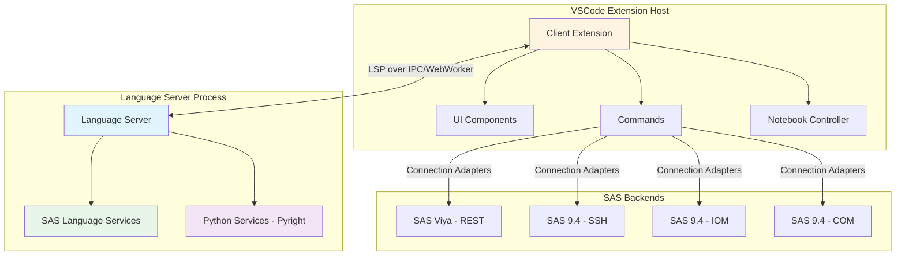

---

## Component Architecture

### 1. Dual Runtime Support

The extension supports both Node.js (desktop) and Browser (web) environments:

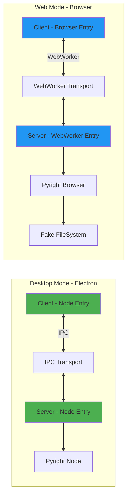

**Entry Points:**

| Runtime | Client Entry | Server Entry |
|---------|--------------|--------------|
| **Node/Desktop** | `client/src/node/extension.ts` | `server/src/node/server.ts` |
| **Browser/Web** | `client/src/browser/extension.ts` | `server/src/browser/server.ts` |

---

## Language Server Architecture

### 2. Language Server Core

The language server is the heart of the extension, providing all code intelligence features:

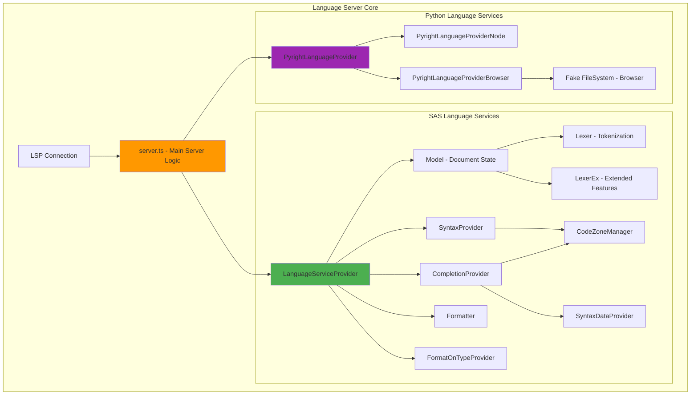

### 3. LSP Capabilities

The server implements comprehensive LSP capabilities:

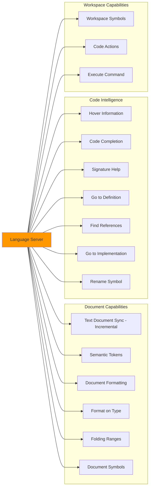

### 4. SAS Language Service Components

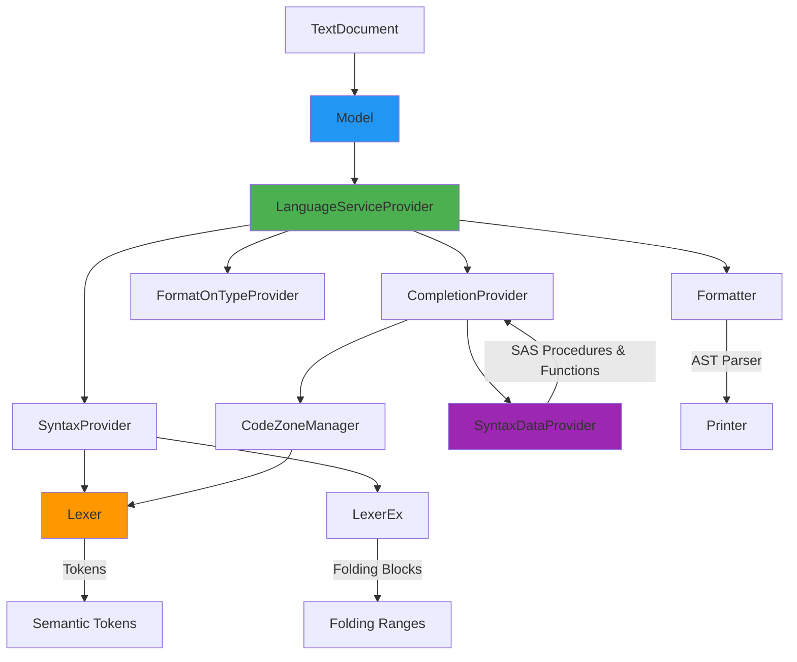

**Component Responsibilities:**

| Component | File | Responsibility |
|-----------|------|----------------|
| **Model** | `Model.ts` | Document state management, line-based access |
| **Lexer** | `Lexer.ts` | Tokenization of SAS code |
| **LexerEx** | `LexerEx.ts` | Extended lexer with folding support |
| **CodeZoneManager** | `CodeZoneManager.ts` | Code zone detection (DATA/PROC/MACRO blocks) |
| **SyntaxProvider** | `SyntaxProvider.ts` | Syntax token generation for semantic highlighting |
| **SyntaxDataProvider** | `SyntaxDataProvider.ts` | Built-in SAS procedures, functions, and help data |
| **CompletionProvider** | `CompletionProvider.ts` | Code completion logic |
| **FormatOnTypeProvider** | `FormatOnTypeProvider.ts` | Format-on-type implementation |
| **Formatter** | `formatter/` | Full document formatting (parser + printer) |
| **LanguageServiceProvider** | `LanguageServiceProvider.ts` | Main orchestrator for all language services |

---

## Client Extension Architecture

### 5. Client Components

```mermaid
graph TD
    subgraph "Extension Activation"
        ExtensionEntry[extension.ts]
        LanguageClient[Language Client]
        ServerOptions[Server Options]
    end

    subgraph "Command Handlers"
        Run[Run Commands]
        Profile[Profile Management]
        Authorize[Authorization]
        Session[Session Management]
        New[New File/Notebook]
    end

    subgraph "UI Components"
        ContentNav[Content Navigator]
        LibraryNav[Library Navigator]
        ResultPanel[Result Panel]
        StatusBar[Status Bar]
        LogViewer[Log Viewer]
    end

    subgraph "Notebook Support"
        Controller[Notebook Controller]
        Serializer[Notebook Serializer]
        LogRenderer[Log Renderer]
        HTMLRenderer[HTML Renderer]
        Exporters[Exporters - HTML/SAS]
    end

    subgraph "Connection Layer"
        ConnectionFactory[Connection Factory]
        REST[REST Adapter - Viya]
        SSH[SSH Adapter]
        IOM[IOM Adapter]
        COM[COM Adapter]
        Studio[Studio Adapter]
    end

    subgraph "State Management"
        Zustand[Zustand Store]
        ProfileStore[Profile Store]
        SessionStore[Session Store]
    end

    ExtensionEntry --> LanguageClient
    ExtensionEntry --> Run
    ExtensionEntry --> Profile
    ExtensionEntry --> ContentNav
    ExtensionEntry --> LibraryNav
    ExtensionEntry --> Controller

    Run --> ConnectionFactory
    Profile --> ProfileStore
    Controller --> Serializer
    Controller --> LogRenderer
    Controller --> HTMLRenderer

    ConnectionFactory --> REST
    ConnectionFactory --> SSH
    ConnectionFactory --> IOM
    ConnectionFactory --> COM
    ConnectionFactory --> Studio

    ContentNav --> Zustand
    LibraryNav --> SessionStore

    style ExtensionEntry fill:#ff9800
    style LanguageClient fill:#4caf50
    style ConnectionFactory fill:#2196f3
```

### 6. Connection Architecture

The client supports multiple connection types to different SAS backends:

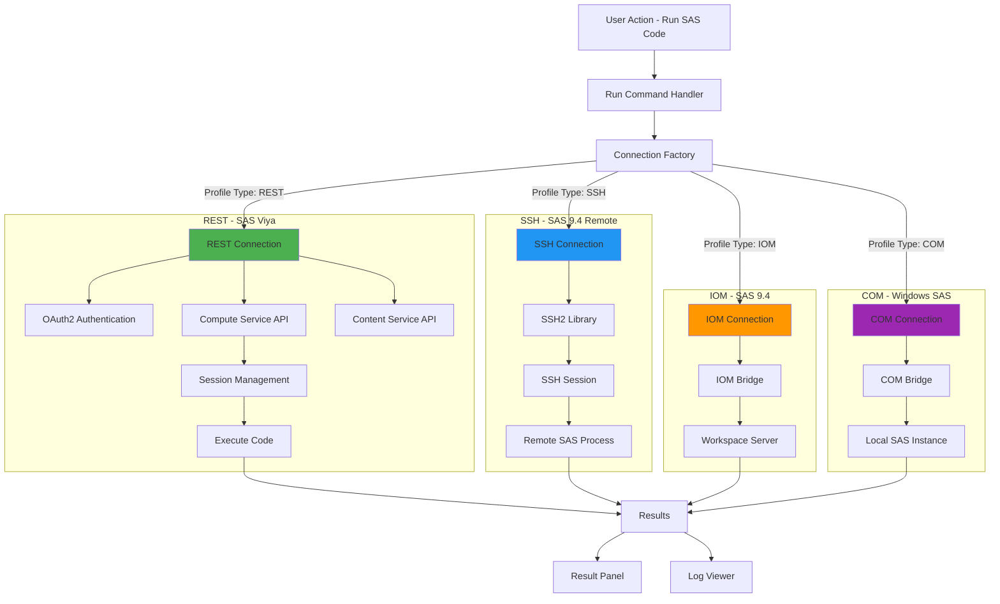

### 7. Notebook Architecture

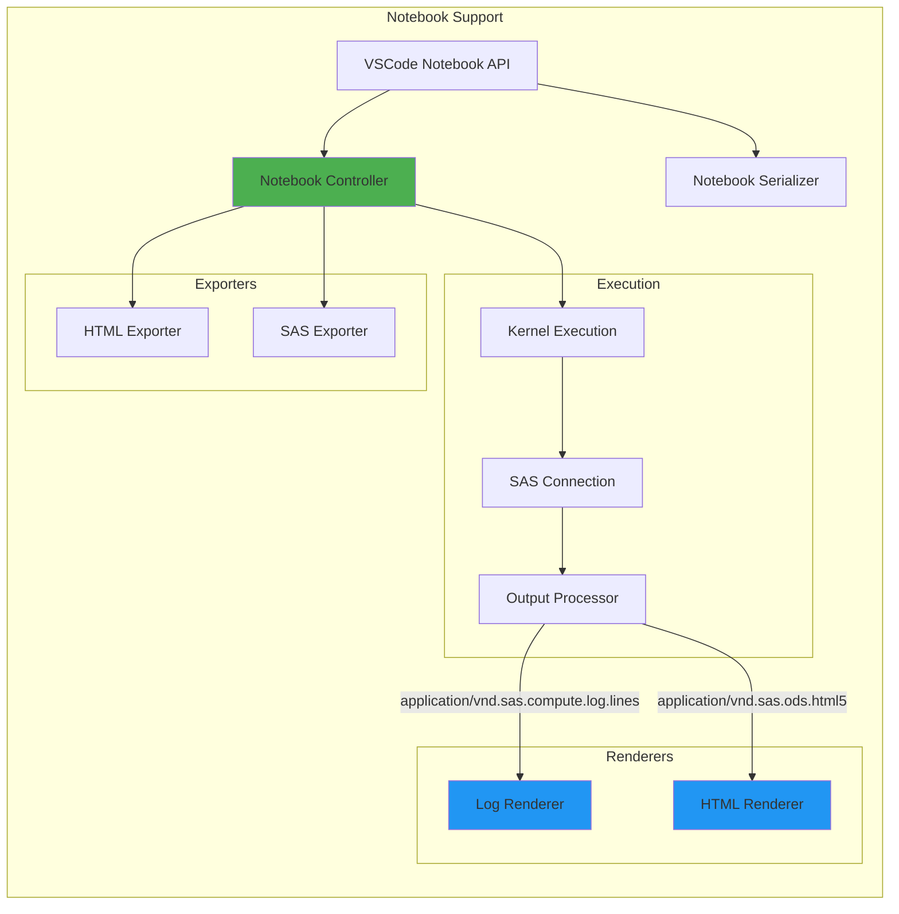

---

## Build System

### 8. Build Architecture

The project uses a dual-build system to support both Node.js and browser environments:

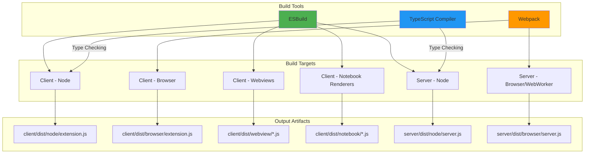

**Build Configuration:**

| Target | Tool | Entry Point | Output |
|--------|------|-------------|--------|
| Client (Node) | ESBuild | `client/src/node/extension.ts` | `client/dist/node/extension.js` |
| Client (Browser) | Webpack | `client/src/browser/extension.ts` | `client/dist/browser/extension.js` |
| Server (Node) | ESBuild | `server/src/node/server.ts` | `server/dist/node/server.js` |
| Server (Browser) | Webpack | `server/src/browser/server.ts` | `server/dist/browser/server.js` |
| Webviews | ESBuild | `client/src/webview/*.tsx` | `client/dist/webview/*.js` |
| Notebook Renderers | ESBuild | `client/src/components/notebook/renderers/*.tsx` | `client/dist/notebook/*.js` |

---

## Language Server Independence Analysis

### 9. Can the Language Server be Extracted?

**Answer: YES** - The SAS language server can be extracted as an independent component. Here's the analysis:

#### Current Dependencies

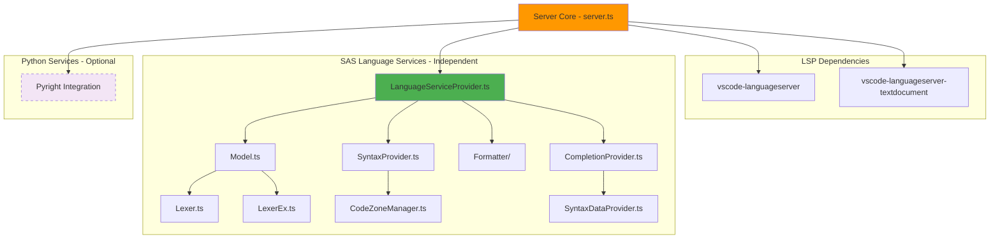

#### Independence Assessment

**Core SAS Language Services (100% Independent):**
- ✅ `Lexer.ts` - No external dependencies
- ✅ `LexerEx.ts` - Only depends on Lexer
- ✅ `Model.ts` - Only depends on LSP TextDocument interface
- ✅ `CodeZoneManager.ts` - Only depends on Lexer
- ✅ `SyntaxProvider.ts` - Only depends on Model and Lexer
- ✅ `SyntaxDataProvider.ts` - Pure data provider
- ✅ `CompletionProvider.ts` - Only depends on internal services
- ✅ `Formatter/` - Only depends on Model and SyntaxProvider
- ✅ `LanguageServiceProvider.ts` - Orchestrates independent services

**Minimal External Dependencies:**
- `vscode-languageserver` - Standard LSP protocol (can use any LSP implementation)
- `vscode-languageserver-textdocument` - Simple TextDocument abstraction

**Optional Dependencies:**
- `pyright-internal-*` - Only for Python language support (can be removed)

#### Portability Analysis

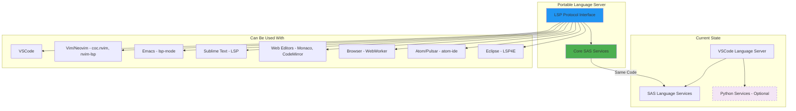

### 10. Web Worker Compatibility

**Can it run as a Web Worker in the browser? YES!**

The extension **already supports browser/WebWorker mode**:

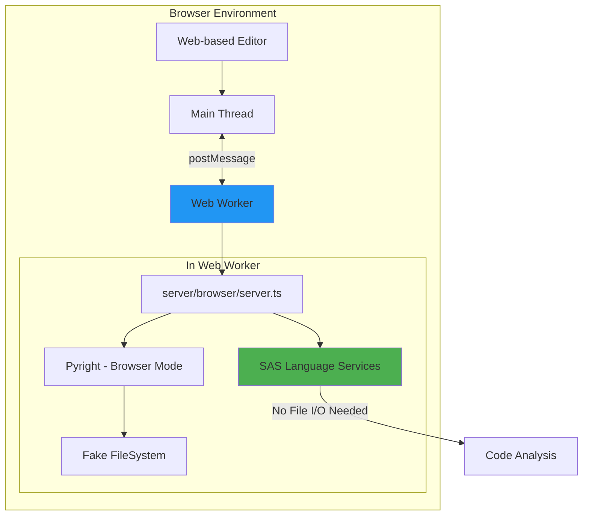

**Current Browser Implementation:**
- Entry: `server/src/browser/server.ts`
- Transport: `BrowserMessageReader/Writer` (postMessage API)
- Pyright: Uses browser-specific version with fake filesystem
- Build: Webpack bundles for browser environment

**Requirements for Browser/WebWorker:**
- ✅ No Node.js file system access (already implemented)
- ✅ Uses LSP protocol over postMessage (already implemented)
- ✅ All language services work without file I/O (already implemented)
- ✅ Bundled as single JavaScript file (already implemented)

---

## Key Technologies

### 11. Technology Stack

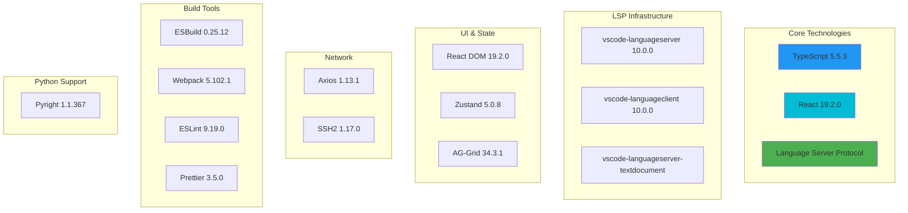

---

## File Structure

### 12. Directory Organization

```
/home/user/sas-lsp/
├── client/                          # VSCode Extension Client
│   ├── src/
│   │   ├── node/                   # Node.js entry point
│   │   │   └── extension.ts        # Main activation
│   │   ├── browser/                # Browser entry point
│   │   │   └── extension.ts        # Web activation
│   │   ├── commands/               # Command handlers
│   │   │   ├── run.ts             # Run SAS code
│   │   │   ├── authorize.ts       # Authentication
│   │   │   ├── profile.ts         # Profile management
│   │   │   ├── new.ts             # New file/notebook
│   │   │   └── ...
│   │   ├── components/            # Core components
│   │   │   ├── notebook/          # Notebook support
│   │   │   ├── ContentNavigator/  # Content tree
│   │   │   ├── LibraryNavigator/  # Library explorer
│   │   │   ├── ResultPanel/       # Results viewer
│   │   │   ├── logViewer/         # Log parsing
│   │   │   ├── profile.ts         # Profile definitions
│   │   │   └── AuthProvider.ts    # OAuth provider
│   │   ├── connection/            # Connection adapters
│   │   │   ├── rest/              # SAS Viya
│   │   │   ├── ssh/               # SSH connections
│   │   │   ├── iom/               # IOM connections
│   │   │   ├── com/               # COM connections
│   │   │   └── index.ts           # Factory
│   │   ├── webview/               # Webview panels
│   │   │   ├── DataViewer.tsx     # Table viewer
│   │   │   └── ...
│   │   └── store/                 # State management
│   ├── dist/                      # Build output
│   │   ├── node/
│   │   ├── browser/
│   │   ├── webview/
│   │   └── notebook/
│   └── package.json
│
├── server/                         # Language Server
│   ├── src/
│   │   ├── node/                  # Node.js entry
│   │   │   └── server.ts
│   │   ├── browser/               # Browser entry
│   │   │   └── server.ts
│   │   ├── server.ts              # Main server logic
│   │   ├── sas/                   # SAS language services
│   │   │   ├── Lexer.ts           # Tokenizer
│   │   │   ├── LexerEx.ts         # Extended lexer
│   │   │   ├── Model.ts           # Document model
│   │   │   ├── CodeZoneManager.ts # Zone detection
│   │   │   ├── CompletionProvider.ts
│   │   │   ├── SyntaxProvider.ts
│   │   │   ├── SyntaxDataProvider.ts
│   │   │   ├── FormatOnTypeProvider.ts
│   │   │   ├── LanguageServiceProvider.ts
│   │   │   ├── formatter/         # Document formatter
│   │   │   └── utils.ts
│   │   └── python/                # Python support
│   │       ├── PyrightLanguageProvider.ts
│   │       ├── node/
│   │       │   └── PyrightLanguageProviderNode.ts
│   │       └── browser/
│   │           ├── PyrightLanguageProviderBrowser.ts
│   │           └── fakeFileSystem.ts
│   ├── dist/                      # Build output
│   │   ├── node/
│   │   └── browser/
│   └── package.json
│
├── syntaxes/                      # TextMate grammars
│   ├── sas.tmLanguage.json       # SAS syntax
│   └── sassql.tmLanguage.json    # SQL syntax
│
├── themes/                        # Color themes
├── snippets/                      # Code snippets
├── icons/                         # Extension icons
├── l10n/                          # Localization (11 languages)
├── tools/                         # Build scripts
│   └── build.mjs                 # ESBuild config
│
├── package.json                   # Root manifest
├── webpack.config.js              # Webpack config
├── tsconfig.json                  # TypeScript config
└── language-configuration.json    # Language config
```

---

## Summary

### Architectural Highlights

1. **Clean Separation**: Client handles UI/UX and connections; server provides language intelligence
2. **LSP-Based**: Standard Language Server Protocol enables editor independence
3. **Dual Runtime**: Supports both Node.js (desktop) and browser (web) environments
4. **Modular Design**: Core SAS language services are independent and reusable
5. **Multi-Backend**: Flexible connection layer supports various SAS backends
6. **Rich Features**: Notebooks, content navigation, result viewers, and more
7. **Modern Stack**: TypeScript, React, LSP, ESBuild, and Webpack
8. **Internationalized**: Support for 11+ languages
9. **Comprehensive Testing**: Unit and E2E tests included

### Language Server Independence

The SAS language server **can be extracted** as an independent component:

✅ **Core language services are self-contained** (Lexer, Parser, Completion, etc.)
✅ **Minimal dependencies** (only standard LSP protocol)
✅ **Already browser-compatible** (WebWorker support exists)
✅ **Can be used with any LSP client** (Vim, Emacs, Sublime, Monaco, etc.)
✅ **Python support is optional** (can be removed if not needed)

**Next Steps for Extraction:**
1. Create standalone `sas-language-server` package
2. Extract `server/src/sas/` as core module
3. Provide thin LSP wrapper (`server/src/server.ts`)
4. Publish to npm for use in other editors
5. Provide browser bundle for web editors
6. Create LSP client examples for popular editors

The architecture is well-designed for this use case and requires minimal refactoring.
