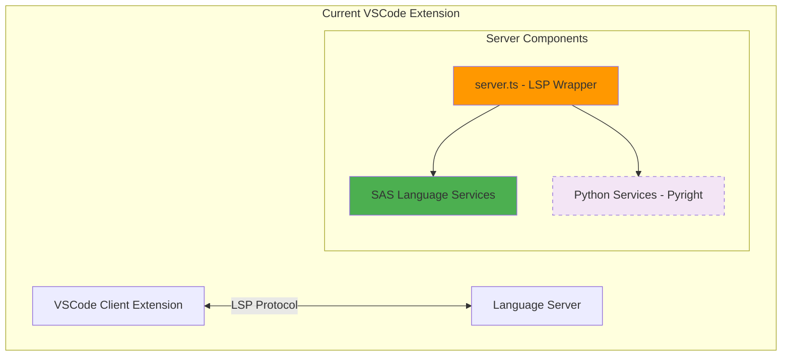
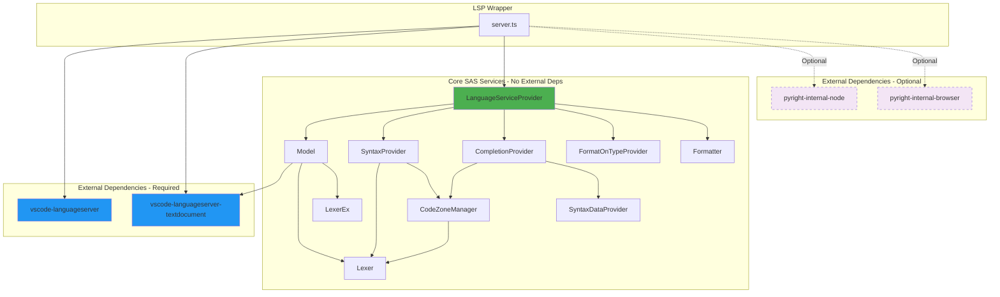
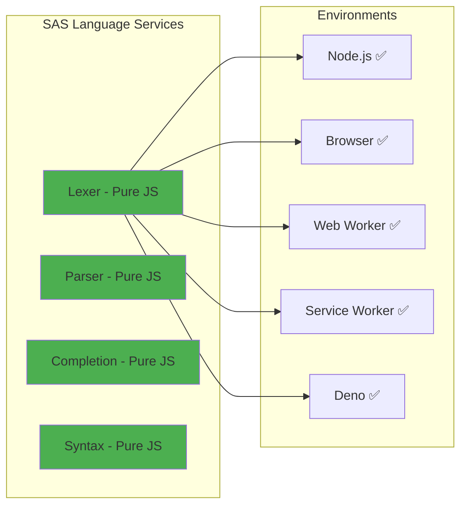
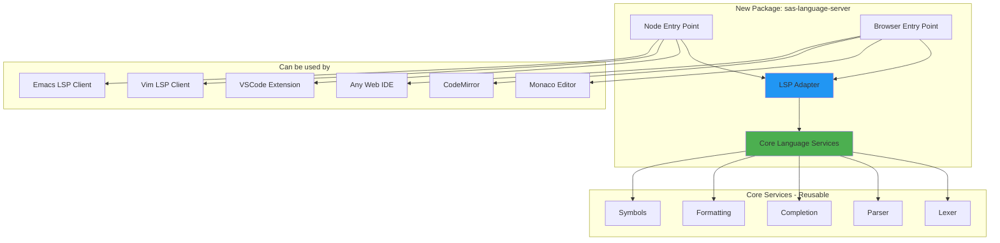
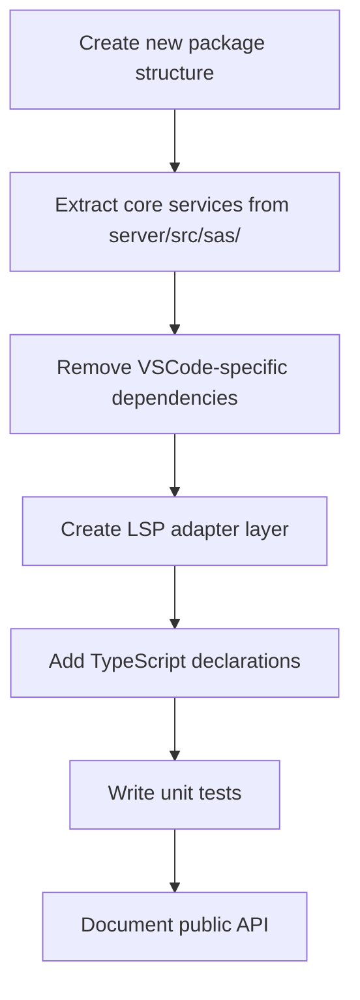
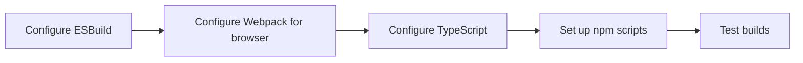

# SAS Language Server Extraction - Feasibility Study

## Executive Summary

**Conclusion: ✅ YES - The SAS language server CAN be extracted as an independent component**

The SAS language server is well-architected and can be extracted with minimal effort. The core language services have minimal dependencies and already support both Node.js and browser/WebWorker environments.

---

## Table of Contents

1. [Current State Analysis](#current-state-analysis)
2. [Dependency Analysis](#dependency-analysis)
3. [Browser/WebWorker Compatibility](#browserwebworker-compatibility)
4. [Extraction Strategy](#extraction-strategy)
5. [Integration Examples](#integration-examples)
6. [Implementation Roadmap](#implementation-roadmap)

---

## Current State Analysis

### Architecture Overview



### Core SAS Language Services

The core SAS language services are located in `server/src/sas/` and are **completely independent**:

| File | Size | Purpose | External Dependencies |
|------|------|---------|----------------------|
| `Lexer.ts` | 29.9 KB | Tokenization | None |
| `LexerEx.ts` | 117.9 KB | Extended lexing + folding | Lexer.ts only |
| `Model.ts` | - | Document state management | TextDocument interface only |
| `CodeZoneManager.ts` | 79.7 KB | Code zone detection | Lexer.ts only |
| `SyntaxProvider.ts` | 13 KB | Syntax highlighting | Model.ts, Lexer.ts |
| `SyntaxDataProvider.ts` | 74.3 KB | SAS procedures/functions | None (pure data) |
| `CompletionProvider.ts` | 63.3 KB | Code completion | Internal services only |
| `FormatOnTypeProvider.ts` | 15.8 KB | Format-on-type | Internal services only |
| `LanguageServiceProvider.ts` | 7.5 KB | Service orchestrator | Internal services only |
| `formatter/` | - | Document formatting | Internal services only |
| `utils.ts` | - | Utility functions | None |

**Key Finding:** All core SAS language services form a **self-contained module** with NO external dependencies beyond basic LSP types.

---

## Dependency Analysis

### Dependency Tree



### Required Dependencies

**Minimal Required Dependencies:**

```json
{
  "dependencies": {
    "vscode-languageserver": "^10.0.0-next.2",
    "vscode-languageserver-textdocument": "1.0.11"
  }
}
```

**Why these are acceptable:**
- `vscode-languageserver` implements the standard LSP protocol (editor-agnostic)
- `vscode-languageserver-textdocument` provides a simple TextDocument abstraction
- Both are **small** (~100KB combined) and have **no Node.js-specific code**
- Both work in **browser environments** via separate browser builds

**Optional Dependencies (can be removed):**
- `pyright-internal-node` - Only needed for Python language support
- `pyright-internal-browser` - Only needed for Python in browser

---

## Browser/WebWorker Compatibility

### Current Browser Support

**The language server ALREADY runs in browsers as a WebWorker!**

#### Implementation Details

**Browser Entry Point:** `server/src/browser/server.ts`

```typescript
// Current browser implementation
import { Connection } from "vscode-languageserver";
import {
  BrowserMessageReader,
  BrowserMessageWriter,
  createConnection,
} from "vscode-languageserver/browser";

const messageReader = new BrowserMessageReader(self);
const messageWriter = new BrowserMessageWriter(self);

const connection: Connection = createConnection(messageReader, messageWriter);

runServer(connection, new PyrightLanguageProviderBrowser(connection, 1));
```

**Key Points:**
- ✅ Uses `postMessage` API for communication (standard WebWorker communication)
- ✅ No file system access required for core SAS features
- ✅ All SAS language services work without I/O
- ✅ Bundled as single JS file via Webpack

### Browser Compatibility Matrix



**Why it works everywhere:**
- No file system operations
- No Node.js-specific APIs
- Pure JavaScript/TypeScript
- Only requires TextDocument abstraction

---

## Extraction Strategy

### Proposed Package Structure



### Recommended Package Layout

```
sas-language-server/
├── src/
│   ├── core/                      # Core language services
│   │   ├── lexer/
│   │   │   ├── Lexer.ts
│   │   │   └── LexerEx.ts
│   │   ├── model/
│   │   │   └── Model.ts
│   │   ├── completion/
│   │   │   ├── CompletionProvider.ts
│   │   │   ├── CodeZoneManager.ts
│   │   │   └── SyntaxDataProvider.ts
│   │   ├── formatting/
│   │   │   ├── Formatter.ts
│   │   │   └── FormatOnTypeProvider.ts
│   │   ├── syntax/
│   │   │   └── SyntaxProvider.ts
│   │   └── services/
│   │       └── LanguageServiceProvider.ts
│   │
│   ├── lsp/                       # LSP adapter layer
│   │   └── server.ts
│   │
│   ├── node/                      # Node.js entry
│   │   └── index.ts
│   │
│   └── browser/                   # Browser entry
│       └── index.ts
│
├── dist/
│   ├── node/                      # Node.js build
│   │   └── index.js
│   ├── browser/                   # Browser build
│   │   └── index.js
│   └── core/                      # Core services (can be used directly)
│       └── index.js
│
├── package.json
├── tsconfig.json
└── README.md
```

### Package.json Configuration

```json
{
  "name": "sas-language-server",
  "version": "1.0.0",
  "description": "Language Server Protocol implementation for SAS",
  "author": "SAS Institute Inc.",
  "license": "Apache-2.0",
  "main": "dist/node/index.js",
  "browser": "dist/browser/index.js",
  "types": "dist/core/index.d.ts",
  "exports": {
    ".": {
      "node": "./dist/node/index.js",
      "browser": "./dist/browser/index.js",
      "default": "./dist/core/index.js"
    },
    "./core": "./dist/core/index.js"
  },
  "bin": {
    "sas-language-server": "./dist/node/index.js"
  },
  "files": [
    "dist",
    "README.md",
    "LICENSE"
  ],
  "dependencies": {
    "vscode-languageserver": "^10.0.0",
    "vscode-languageserver-textdocument": "^1.0.11"
  },
  "keywords": [
    "sas",
    "language-server",
    "lsp",
    "language-server-protocol",
    "editor",
    "ide",
    "autocomplete",
    "syntax-highlighting"
  ]
}
```

---

## Integration Examples

### 1. VSCode Extension (Already Implemented)

```typescript
// client/src/node/extension.ts
import { LanguageClient, ServerOptions } from "vscode-languageclient/node";

const serverModule = require.resolve("sas-language-server/node");

const serverOptions: ServerOptions = {
  run: { module: serverModule, transport: TransportKind.ipc },
  debug: { module: serverModule, transport: TransportKind.ipc }
};

const client = new LanguageClient(
  "sas-lsp",
  "SAS Language Server",
  serverOptions,
  clientOptions
);

client.start();
```

### 2. Vim/Neovim with coc.nvim

```json
// coc-settings.json
{
  "languageserver": {
    "sas": {
      "command": "sas-language-server",
      "args": ["--stdio"],
      "filetypes": ["sas"],
      "rootPatterns": [".git", ".sasrc"]
    }
  }
}
```

### 3. Neovim with native LSP

```lua
-- init.lua
local lspconfig = require('lspconfig')
local configs = require('lspconfig.configs')

configs.sas_lsp = {
  default_config = {
    cmd = {'sas-language-server', '--stdio'},
    filetypes = {'sas'},
    root_dir = lspconfig.util.root_pattern('.git', '.sasrc'),
    settings = {},
  },
}

lspconfig.sas_lsp.setup{}
```

### 4. Emacs with lsp-mode

```elisp
;; .emacs or init.el
(require 'lsp-mode)

(add-to-list 'lsp-language-id-configuration '(sas-mode . "sas"))

(lsp-register-client
 (make-lsp-client :new-connection (lsp-stdio-connection "sas-language-server")
                  :major-modes '(sas-mode)
                  :server-id 'sas-lsp))

(add-hook 'sas-mode-hook #'lsp)
```

### 5. Monaco Editor (Browser)

```typescript
// Web application
import * as monaco from 'monaco-editor';

// Create a WebWorker for the language server
const worker = new Worker('sas-language-server/browser/index.js');

// Register the language
monaco.languages.register({ id: 'sas' });

// Set up language features
monaco.languages.registerCompletionItemProvider('sas', {
  provideCompletionItems: (model, position) => {
    // Forward to WebWorker
    return new Promise((resolve) => {
      worker.postMessage({
        type: 'completion',
        uri: model.uri.toString(),
        position: position
      });

      worker.onmessage = (e) => {
        if (e.data.type === 'completion') {
          resolve(e.data.items);
        }
      };
    });
  }
});
```

### 6. CodeMirror 6 (Browser)

```typescript
import { EditorView } from '@codemirror/view';
import { LanguageServerClient } from '@codemirror/language-server';

// Create language server client using WebWorker
const worker = new Worker('sas-language-server/browser/index.js');

const lsClient = new LanguageServerClient({
  transport: {
    send: (msg) => worker.postMessage(msg),
    onMessage: (callback) => {
      worker.onmessage = (e) => callback(e.data);
    }
  }
});

// Create editor with SAS support
const editor = new EditorView({
  extensions: [
    lsClient.extension,
    // ... other extensions
  ]
});
```

### 7. Sublime Text with LSP

```json
// LSP.sublime-settings
{
  "clients": {
    "sas": {
      "enabled": true,
      "command": ["sas-language-server", "--stdio"],
      "selector": "source.sas",
      "languageId": "sas"
    }
  }
}
```

### 8. Direct API Usage (No LSP)

For cases where you want to use the language services directly without LSP:

```typescript
import { LanguageServiceProvider } from 'sas-language-server/core';
import { TextDocument } from 'vscode-languageserver-textdocument';

// Create a text document
const document = TextDocument.create(
  'file:///test.sas',
  'sas',
  1,
  'data test;\n  x = 1;\nrun;'
);

// Create language service
const service = new LanguageServiceProvider(document);

// Get semantic tokens
const tokens = service.getTokens();

// Get completions
const completions = service.completionProvider.getCompletion({
  line: 1,
  column: 5
});

// Get document symbols
const symbols = service.getDocumentSymbols();

// Format document
const formatted = service.formatter.format();
```

---

## Implementation Roadmap

### Phase 1: Extract Core Services (1-2 weeks)



**Tasks:**
1. ✅ Create `sas-language-server` package structure
2. ✅ Copy core services from `server/src/sas/` to `src/core/`
3. ✅ Ensure no VSCode-specific imports
4. ✅ Create thin LSP wrapper in `src/lsp/server.ts`
5. ✅ Add Node.js entry point in `src/node/index.ts`
6. ✅ Add browser entry point in `src/browser/index.ts`
7. ✅ Configure TypeScript for multiple build targets
8. ✅ Write comprehensive tests
9. ✅ Create API documentation

### Phase 2: Build Configuration (1 week)



**Tasks:**
1. ✅ Configure ESBuild for Node.js target
2. ✅ Configure Webpack for browser target
3. ✅ Configure TypeScript with proper module resolution
4. ✅ Create npm scripts for building
5. ✅ Test Node.js build
6. ✅ Test browser build
7. ✅ Verify bundle sizes

### Phase 3: Documentation & Examples (1 week)

**Tasks:**
1. ✅ Write comprehensive README
2. ✅ Create integration guides for popular editors
3. ✅ Write API documentation
4. ✅ Create example projects:
   - VSCode extension example
   - Monaco editor example
   - Vim configuration example
   - Emacs configuration example
5. ✅ Create migration guide from current extension

### Phase 4: Testing & Validation (1 week)

**Tasks:**
1. ✅ Create test suite for core services
2. ✅ Test with VSCode
3. ✅ Test with Monaco Editor
4. ✅ Test with Vim
5. ✅ Test with Emacs
6. ✅ Performance benchmarks
7. ✅ Bundle size analysis

### Phase 5: Publish & Integrate (1 week)

**Tasks:**
1. ✅ Publish to npm as `sas-language-server`
2. ✅ Update current VSCode extension to use npm package
3. ✅ Create standalone CLI tool
4. ✅ Publish documentation
5. ✅ Create announcement/blog post
6. ✅ Submit to LSP server directory

**Total Estimated Time:** 5-6 weeks

---

## Technical Challenges & Solutions

### Challenge 1: TextDocument Abstraction

**Problem:** Core services depend on VSCode's TextDocument type.

**Solution:**
- Use `vscode-languageserver-textdocument` which provides editor-agnostic implementation
- This library is already used and works in all environments
- Size: ~5KB, no dependencies

### Challenge 2: Python Support (Pyright)

**Problem:** Current server includes Pyright for Python support, adding ~2MB to bundle.

**Solution:**
- Make Python support optional
- Create separate build without Pyright for SAS-only use cases
- Offer two packages:
  - `sas-language-server` (SAS only, ~100KB)
  - `sas-language-server-full` (SAS + Python, ~2MB)

### Challenge 3: Browser Bundle Size

**Problem:** Need to keep browser bundle small for web editors.

**Solution:**
- Use tree-shaking with Webpack
- Exclude Python support from browser build by default
- Optimize imports to avoid bundling unused code
- Target bundle size: <200KB gzipped for SAS-only

### Challenge 4: Testing Across Editors

**Problem:** Need to ensure compatibility with multiple editors.

**Solution:**
- Create automated test suite using LSP protocol
- Test against official LSP test suite
- Create integration examples for each major editor
- Set up CI/CD to test builds

---

## Benefits of Extraction

### For Users

1. **Editor Choice Freedom**
   - Use SAS with your preferred editor (Vim, Emacs, Sublime, etc.)
   - Not locked into VSCode

2. **Web Integration**
   - Use SAS in web-based IDEs
   - Create online SAS playgrounds
   - Integrate into educational platforms

3. **Better Performance**
   - Smaller bundle sizes for specific use cases
   - Optimized builds for different environments

### For Developers

1. **Easier Contribution**
   - Core language services in standalone package
   - Clear separation of concerns
   - Better testability

2. **Reusability**
   - Use language services directly in other tools
   - Build custom SAS tools and extensions
   - Create specialized SAS editors

3. **Maintenance**
   - Single source of truth for language logic
   - Easier to test and debug
   - Better documentation

### For SAS Institute

1. **Wider Adoption**
   - Reach users of all editors
   - Lower barrier to entry
   - Community contributions

2. **Standardization**
   - Follow LSP best practices
   - Participate in LSP ecosystem
   - Better interoperability

3. **Innovation**
   - Enable third-party integrations
   - Foster SAS tooling ecosystem
   - Encourage educational use

---

## Conclusion

### Feasibility: ✅ HIGH

The SAS language server is **highly suitable for extraction** because:

1. ✅ **Core services are already independent** - minimal refactoring needed
2. ✅ **Already supports browser/WebWorker** - proven browser compatibility
3. ✅ **Minimal dependencies** - only standard LSP libraries
4. ✅ **Clean architecture** - well-separated concerns
5. ✅ **Optional Python support** - can be excluded for smaller builds

### Recommended Next Steps

1. **Immediate (Week 1-2)**
   - Create `sas-language-server` package structure
   - Extract core services
   - Set up build configuration

2. **Short-term (Week 3-4)**
   - Write documentation and examples
   - Create integration guides
   - Set up testing infrastructure

3. **Medium-term (Week 5-6)**
   - Publish to npm
   - Update VSCode extension to use package
   - Create editor integration examples

4. **Long-term (After release)**
   - Gather community feedback
   - Create plugins for popular editors
   - Expand feature set based on demand

### Expected Outcomes

- **Standalone npm package:** `sas-language-server`
- **Bundle sizes:**
  - Node.js: ~150KB
  - Browser (SAS only): ~200KB gzipped
  - Browser (with Python): ~2MB gzipped
- **Supported editors:** VSCode, Vim, Neovim, Emacs, Sublime Text, Monaco, CodeMirror, and more
- **Supported environments:** Node.js, Browser, WebWorker, Service Worker, Deno

The extraction is **technically feasible**, **architecturally sound**, and would provide **significant value** to the SAS programming community.
